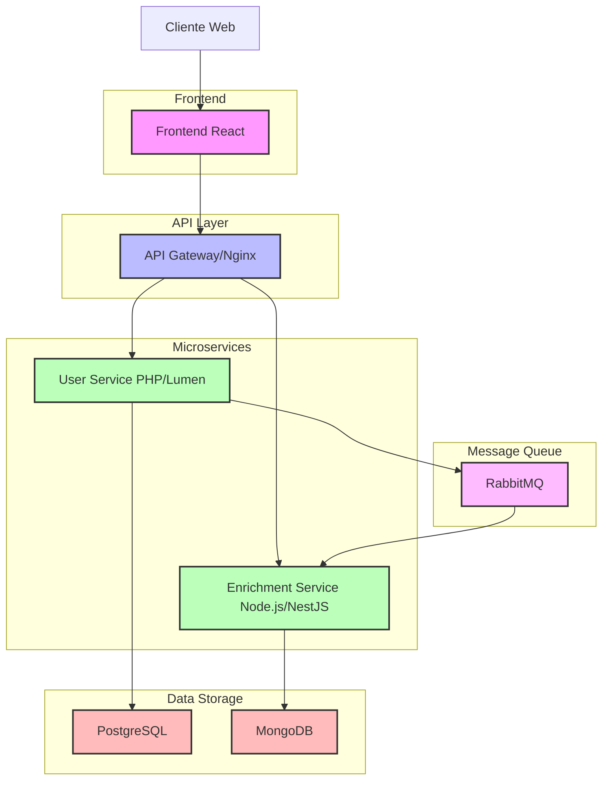

# Diagrama de Arquitetura do Sistema

Este diagrama mostra a arquitetura básica do sistema, incluindo os componentes principais e suas interações.

## Descrição dos Componentes

1. **Cliente Web**: Navegador do usuário final
2. **Frontend React**: Aplicação React que fornece a interface de usuário
3. **API Gateway/Nginx**: Proxy reverso que roteia requisições para os serviços apropriados
4. **User Service (PHP/Lumen)**: Serviço responsável pelo gerenciamento de usuários
5. **Enrichment Service (Node.js/NestJS)**: Serviço responsável pelo enriquecimento de dados de usuário
6. **PostgreSQL**: Banco de dados relacional para armazenamento de dados de usuário
7. **RabbitMQ**: Sistema de mensageria para comunicação assíncrona entre serviços
8. **MongoDB**: Banco de dados NoSQL para armazenamento de dados enriquecidos 