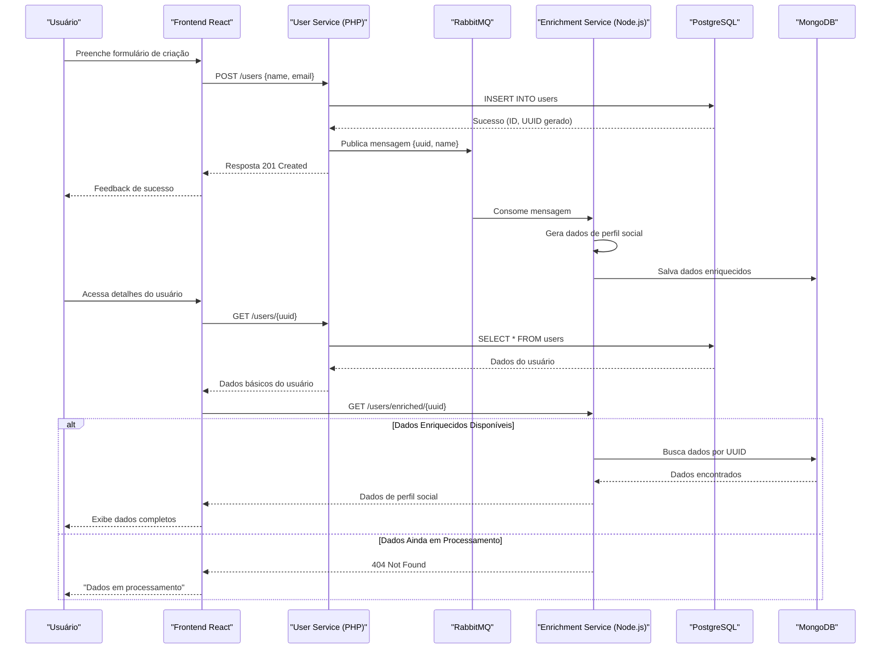

# Diagrama de Fluxo de Dados

Este diagrama mostra o fluxo de dados entre os diferentes componentes do sistema, incluindo a criação de usuário e o processo de enriquecimento de dados.

## Descrição dos Fluxos

### Fluxo de Criação de Usuário
1. O usuário preenche o formulário de criação no frontend
2. O frontend envia uma requisição POST para o User Service
3. O User Service valida os dados e insere o usuário no PostgreSQL
4. Após salvar com sucesso, o User Service publica uma mensagem no RabbitMQ
5. O frontend recebe a confirmação e mostra feedback ao usuário

### Processamento Assíncrono
1. O Enrichment Service consome a mensagem do RabbitMQ
2. O serviço gera dados de perfil social (LinkedIn, GitHub)
3. Os dados enriquecidos são salvos no MongoDB

### Fluxo de Detalhes do Usuário
1. O usuário acessa a página de detalhes de um usuário
2. O frontend solicita os dados básicos ao User Service
3. Em seguida, solicita os dados enriquecidos ao Enrichment Service
4. Se os dados enriquecidos estiverem disponíveis, são exibidos
5. Caso contrário, uma mensagem de "Dados em processamento" é mostrada 