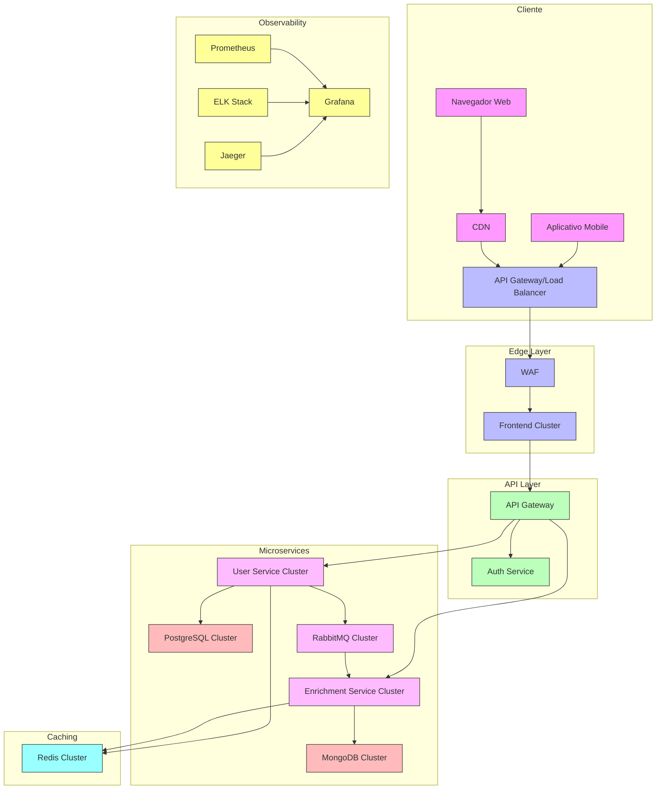

# Arquitetura de Produção

Este diagrama ilustra uma arquitetura de produção robusta para o sistema, incluindo componentes para escalabilidade, alta disponibilidade, segurança e observabilidade.

## Componentes da Arquitetura de Produção

### Camada de Cliente
- **Navegador Web**: Interface de usuário acessada via navegador
- **CDN**: Rede de distribuição de conteúdo para entrega rápida de assets estáticos
- **Aplicativo Mobile**: Aplicações móveis que consomem as mesmas APIs

### Edge Layer
- **API Gateway/Load Balancer**: Distribui o tráfego e gerencia requisições
- **WAF (Web Application Firewall)**: Protege contra ataques comuns
- **Frontend Cluster**: Múltiplas instâncias do frontend para alta disponibilidade

### API Layer
- **API Gateway**: Gerencia rotas, autenticação e rate limiting
- **Auth Service**: Serviço centralizado de autenticação e autorização

### Microservices
- **User Service Cluster**: Múltiplas instâncias do serviço de usuários
- **Enrichment Service Cluster**: Múltiplas instâncias do serviço de enriquecimento
- **PostgreSQL Cluster**: Configuração Master-Replica para alta disponibilidade
- **RabbitMQ Cluster**: Cluster de mensageria com nós espelhados
- **MongoDB Cluster**: ReplicaSet para alta disponibilidade

### Observability
- **Prometheus**: Coleta de métricas
- **Grafana**: Visualização de métricas e dashboards
- **ELK Stack**: Centralização e análise de logs
- **Jaeger**: Tracing distribuído

### Caching
- **Redis Cluster**: Cache distribuído para melhorar performance

## Estratégias de Escalabilidade e Alta Disponibilidade

1. **Escalabilidade Horizontal**: Todos os serviços são projetados para escalar horizontalmente
2. **Auto-scaling**: Baseado em métricas de utilização (CPU, memória, latência)
3. **Redundância**: Múltiplas instâncias em zonas de disponibilidade diferentes
4. **Failover Automático**: Detecção de falhas e recuperação automática
5. **Circuit Breakers**: Prevenção de falhas em cascata

## Segurança

1. **WAF**: Proteção contra ataques comuns (XSS, CSRF, injeção SQL)
2. **Autenticação e Autorização**: OAuth 2.0 / JWT / RBAC
3. **Criptografia**: TLS/SSL para dados em trânsito, criptografia para dados sensíveis
4. **Gestão de Segredos**: Vault ou KMS para gerenciamento de credenciais

## Observabilidade

1. **Monitoramento**: Métricas de performance e saúde do sistema
2. **Logging**: Logs centralizados com correlação entre serviços
3. **Tracing**: Rastreamento de requisições através dos serviços
4. **Alertas**: Notificações baseadas em thresholds e anomalias 